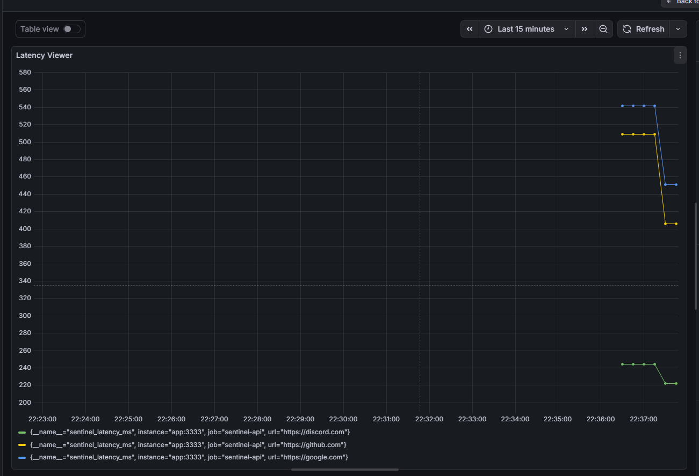

# 🛡️ Sentinel Monitor


> Sistema completo de Observabilidade e Monitoramento de APIs focado em SRE (Site Reliability Engineering).

O **Sentinel Monitor** é uma aplicação distribuída que realiza verificações de saúde (Health Checks) automáticas em serviços web, coleta métricas de latência e disponibilidade, e expõe dados para dashboards em tempo real.

O diferencial deste projeto é sua **Infraestrutura 100% Containerizada**, simulando um ambiente de produção real com Proxy Reverso, Banco de Dados, Workers e Ferramentas de Monitoramento orquestradas via Docker Compose.

---

## 📸 Dashboards



---

## 🏗️ Arquitetura do Projeto

O sistema foi desenhado seguindo princípios de **Microsserviços** e **Clean Architecture**:

| Componente | Tecnologia | Função |
| :--- | :--- | :--- |
| **API & Worker** | Node.js (Fastify) + TypeScript | Gerencia o agendamento (Cron) e a lógica de verificação. |
| **Proxy Reverso** | Nginx | Gateway de entrada e Load Balancer (Porta 80). |
| **Banco de Dados** | PostgreSQL + Prisma ORM | Armazena histórico persistente de logs. |
| **Coleta de Métricas** | Prometheus | Scraper de dados em tempo real (`/metrics`). |
| **Visualização** | Grafana | Dashboards gráficos de Latência e Uptime. |
| **Orquestração** | Docker Compose | Gerenciamento de containers e redes internas. |

---

## 🚀 Como Rodar (Quick Start)

Graças ao Docker, você não precisa instalar Node.js ou Banco de Dados na sua máquina.

### Pré-requisitos
* [Docker](https://www.docker.com/) e Docker Compose instalados.

### Passo a Passo

1. **Clone o repositório:**
   ```bash
   git clone [https://github.com/hash-cell/sentinel-monitor.git](https://github.com/hash-cell/sentinel-monitor.git)
   cd sentinel-monitor
